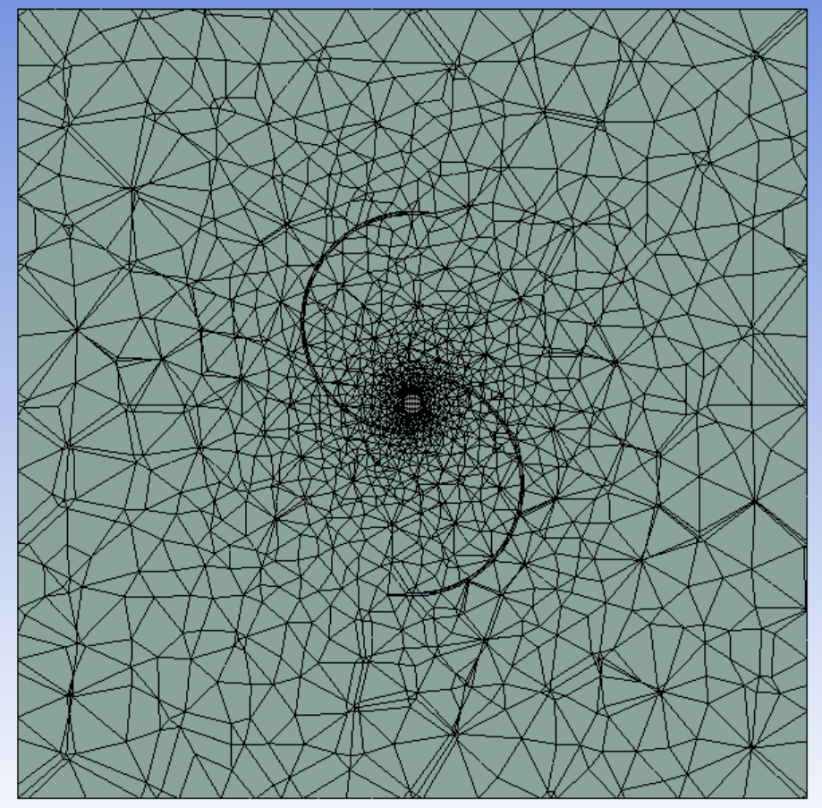
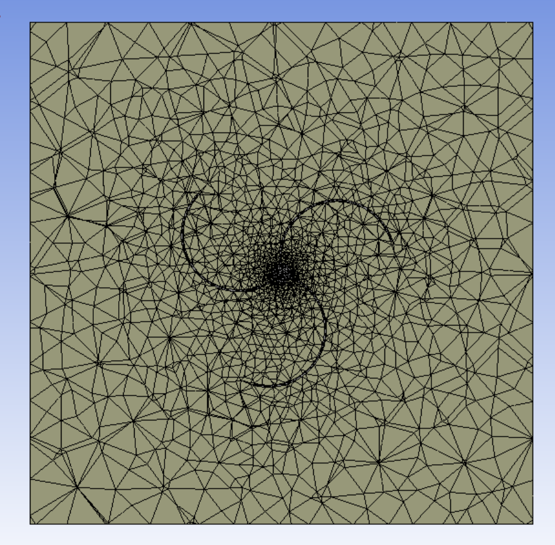
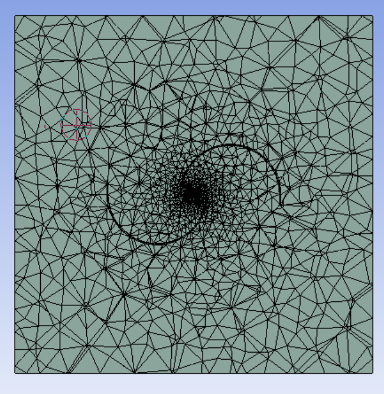
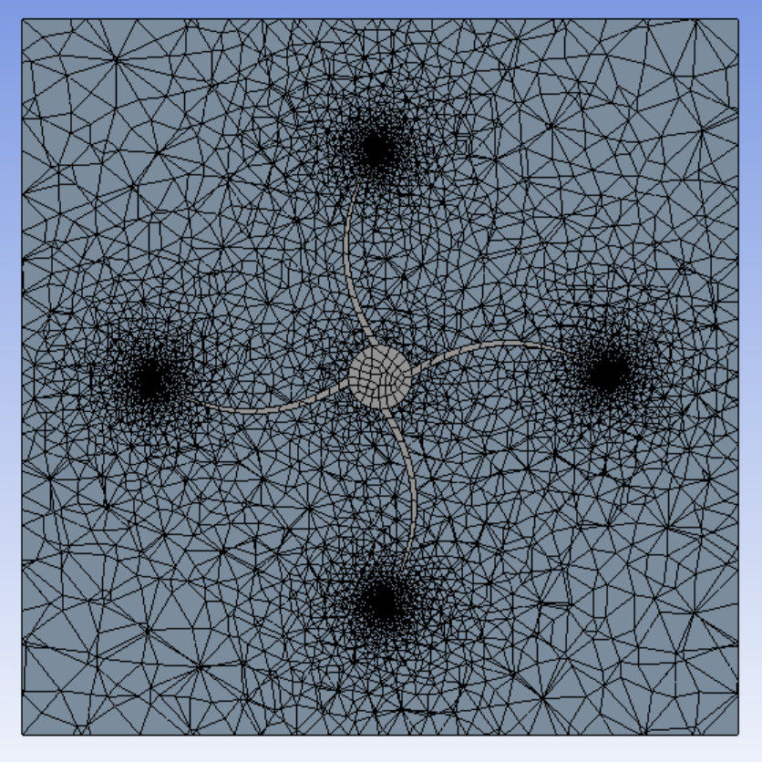
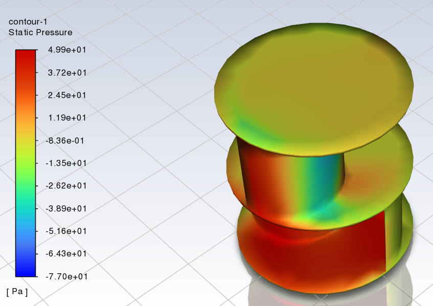
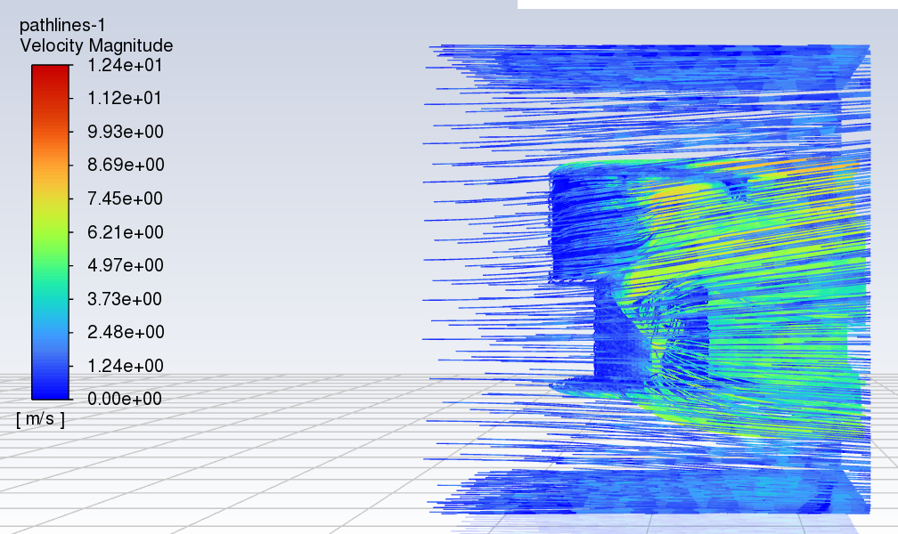
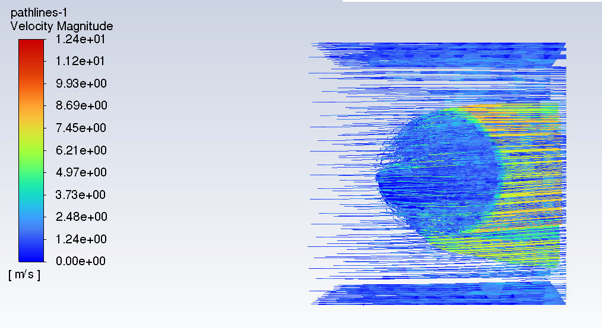

# Wind Turbine: CFD Design & SCADA Data Pipeline


This repository covers two distinct pieces of work on a vertical-axis wind turbine
project: (1) **CFD aerodynamic design** of four turbine blade geometries using Ansys
Fluent, and (2) a separate, independent **SCADA data pipeline** for ingesting and
analysing turbine telemetry. They are not the same body of work — the CFD design is
a mechanical/aerodynamic engineering exercise; the pipeline is a data engineering
exercise built around turbine SCADA output. See each section below.

---

## Part 1: CFD Blade & Flow Design (Ansys Fluent/CFX)

Aerodynamic comparison of four Vertical Axis Wind Turbine (VAWT) designs — Savonius,
Helical 3-Blade, Double-Cup, and Quad-Cup — to identify the most efficient architecture
for small-scale energy generation.

### Methodology
- **Software:** ANSYS Workbench — DesignModeler (geometry/enclosure), Meshing, Fluent (solver)
- **Turbulence model:** SST k-ω (Shear-Stress Transport)
- **Boundary conditions:** inlet velocity 6.3 m/s (Plymouth, UK average wind speed), 284K, fluid = air, solid = aluminium
- **Solution:** hybrid initialisation, 1000 iterations per design

### Results

| Design | Mesh (nodes / elements) | Static pressure Δ | Max velocity magnitude | Drag force |
|---|---|---|---|---|
| Double-Cup | 285,004 / 186,433 | 127.40 Pa | 12.08 m/s | 38.27 N |
| Helical 3-Blade | 240,031 / 159,859 | 114.94 Pa | 11.60 m/s | 38.0 N |
| **Quad-Cup** | 300,675 / 198,561 | 126.89 Pa | **12.42 m/s** | **11.13 N** |
| Savonius | 1,118,805 / 764,141 | 128.03 Pa | 11.18 m/s | 51.97 N |

   

*Mesh domains for each design — left to right: Double-Cup, Helical 3-Blade, Quad-Cup, Savonius.*

### Key Findings
- Double-Cup, Quad-Cup, and Savonius exhibit similar static pressure differentials; Helical 3-Blade is noticeably lower.
- Quad-Cup achieves the highest outlet velocity magnitude of the four designs.
- **Quad-Cup has by far the lowest drag force (11.13 N vs. 38–52 N for the others)** — its velocity pathlines show better flow symmetry and a less turbulent wake, which also means lower blade fatigue, lower noise, and lower maintenance over time.

  

*Quad-Cup: static pressure contour, and velocity magnitude pathlines (side and top view).*

### Conclusion
The Quad-Cup design is the most suitable candidate for small-scale residential/commercial
use, balancing high velocity extraction with significantly lower drag. Full methodology,
all four designs' detailed results, discussion, and limitations are in
[`CFD/cfd_vawt_comparison_report.pdf`](CFD/cfd_vawt_comparison_report.pdf).

---

## Part 2: SCADA Data Pipeline & Downtime Analytics

An end-to-end local ELT (Extract, Load, Transform) data pipeline designed to ingest, standardise, and analyse high-frequency SCADA sensor data from vertical axis wind turbines.

This infrastructure calculates the direct financial and energy impact of mechanical turbine failures by cross-referencing theoretical power curves against actual generation.

### Core Technologies

**Pipeline Infrastructure & Containerisation** — runs on a local Linux server, using Docker to isolate the database, ingestion tools, and visualisation server. This ensures the pipeline is robust, reproducible, and easily scalable.

**Time-Series Relational Database (PostgreSQL / TimescaleDB)** — optimised for large-scale sensor data, acting as the central data warehouse for all ingested SCADA telemetry.

**Advanced SQL Analytics Engine** — utilises complex SQL operations (Window Functions, CTEs, Data Type Transformations) to execute in-database calculations and noise reduction without relying on external processing scripts.

**Interactive Visualisation (Grafana)** — provides a real-time, interactive dashboard to monitor turbine health, mechanical faults, and financial losses over time.

### Engineering Workflow
* **Extraction:** Ingests massive, raw `.csv` telemetry files generated by turbine SCADA systems.
* **Loading & Transformation (ELT):** Loads raw data directly into PostgreSQL, standardising non-compliant timestamps and cleaning null values natively.
* **Noise Reduction:** Implements 5-interval rolling averages using Window Functions to filter erratic wind gusts and reveal true mechanical performance.
* **Downtime Financial Analysis:** Cross-references active wind speed against power output to isolate mechanical faults (e.g., brake failures, grid disconnects) from low-wind periods.

### Repository Structure

* `/CFD/` - CFD methodology report and figures (see Part 1 above).
* `/Infrastructure/` - Contains the `docker-compose.yaml` for spinning up the local PostgreSQL environment and Grafana server.
* `/SQL/` - Core analytical queries and transformations (`01_downtime_analysis.sql`, `02_rolling_average.sql`).
* `/Scripts/` - Shell scripts (`ingest_data.sh`) for automated ELT data ingestion and schema setup.
* `README.md` - Project documentation and architecture overview.

### Execution & Results

**Key Analytics Findings**
* Successfully isolated true mechanical downtime from environmental variables.
* Calculated a peak single-day generation loss of **>350,000 kW** due to identified mechanical and grid-sync failures.

**Local Deployment (Docker)**
```bash
# Clone the repository
git clone https://github.com/dambra100/WindTurbine.git

# Navigate to the infrastructure folder
cd WindTurbine/Infrastructure

# Copy the example env file and set your own credentials
cp .env.example .env

# Spin up the environment
docker-compose up -d

# Navigate to the scripts folder and execute the ELT ingestion script
cd ../Scripts
chmod +x ingest_data.sh
./ingest_data.sh
```
